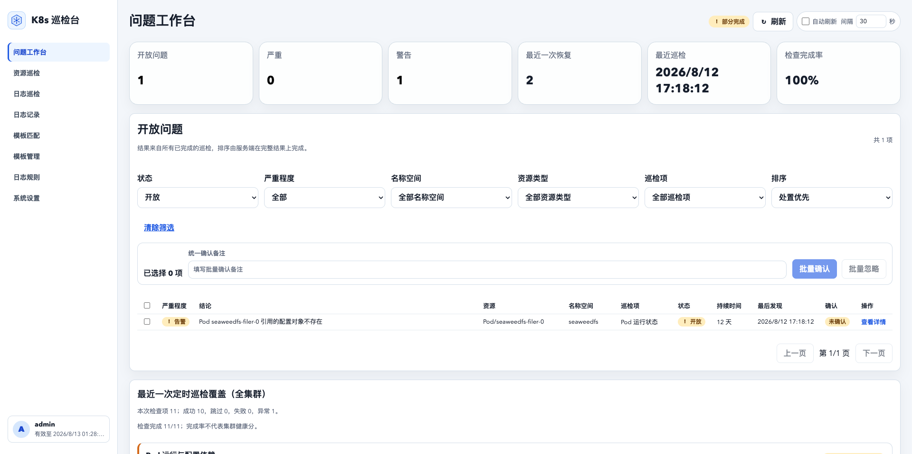
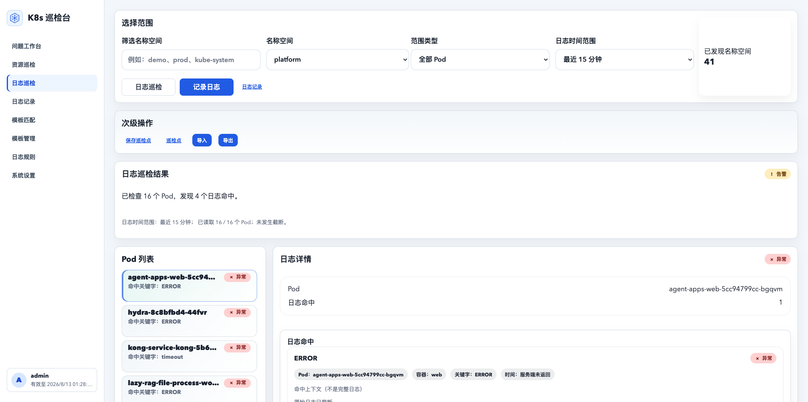
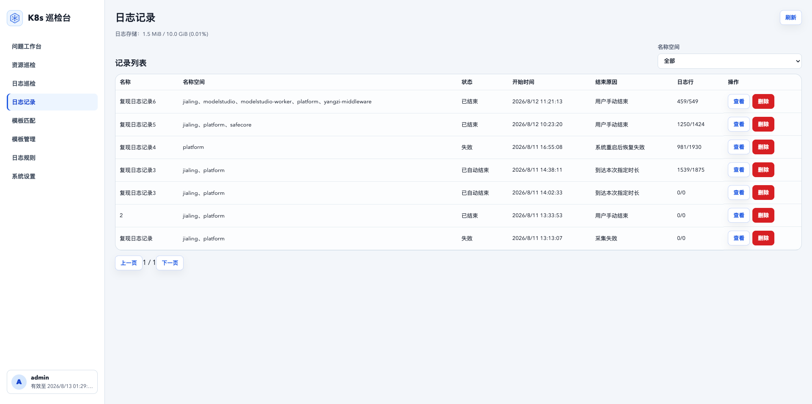
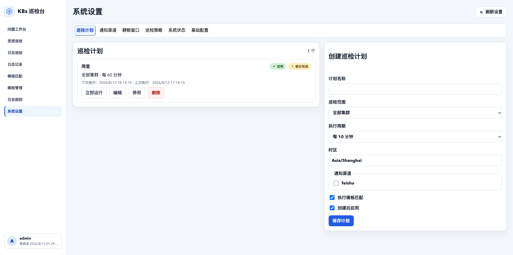

# K8s Inspector

K8s Inspector v1.4.0 是面向单个 Kubernetes 集群的只读巡检与排障系统。它将资源状态、对象关系、事件、受限日志证据、日志记录、镜像清单和问题生命周期集中到一个工作台，帮助运维人员更快定位问题，但不会自动修改集群资源。

## v1.4.0 能力

- 巡检 Deployment、StatefulSet、DaemonSet、Job、CronJob、Pod、Service、EndpointSlice、Ingress、PVC、PV、Node 和可选 Metrics API。
- 区分正常、异常、跳过和采集失败；采集失败不会显示为健康。
- 按指纹合并重复问题，记录开放、升级、确认和恢复时间线。
- 支持“日志记录”：按名称空间启动记录，后台采集复现窗口内所有 Pod 新增日志，长期保存后可搜索、折叠查看、改名、备注、删除和执行日志模板匹配。
- 支持“镜像清单”：按一个或多个名称空间查看 Kubernetes API 可见 Pod 引用的镜像，覆盖初始化容器、运行容器和状态中的 imageID，并可导出 `.txt`。
- 支持手动巡检和单进程定时计划，执行记录保存 API 调用量、日志读取量和耗时。
- 支持飞书群机器人 V2 Webhook 和通用 Webhook 告警，包含签名、失败重试、消息裁剪和目标访问控制。
- 支持本地单管理员登录、服务端 Session、CSRF、登录限流和安全审计。
- 支持根路径、`/inspector/` 子路径，以及同实例根路径 + `/inspector/` 双入口部署。
- 使用 Alembic 将 v1.0.0 SQLite 数据库升级到当前版本。
- 提供 `/health/live`、`/health/ready` 和系统状态页面。

飞书范围仅包括告警通知，不需要 App ID 或 App Secret，也不包含飞书应用机器人、消息接收、卡片按钮回调和远程操作。

## 界面预览

问题工作台集中展示开放、恢复和忽略问题，方便按严重程度、名称空间、资源类型和巡检项筛选。



日志巡检支持按名称空间和时间范围检查 Pod 日志，展示命中关键字、异常 Pod 和日志上下文。



日志记录用于查看复现期间采集的历史任务，支持按名称空间筛选和进入详情查看 Pod 日志。



系统设置集中管理巡检计划、通知渠道、巡检策略、系统状态和基础配置。



## 目录

```text
frontend/                     React + Vite + TypeScript
backend/                      FastAPI + SQLite + Provider
deploy/helm/k8s-inspector/    单副本 Helm Chart
deploy/kk/                    Kubernetes E2E 配置
docs/assets/screenshots/      README 界面截图
docs/v1.1.0/                 v1.1.0 PRD、架构、验收和升级文档
docs/v1.2.0/                 v1.2.0 PRD 和验收文档
docs/v1.3.0/                 v1.3.0 PRD 和验收文档
docs/v1.4.0/                 v1.4.0 PRD 和验收文档
examples/                     模板与白名单示例
```

## 本地开发

安装并启动后端：

```bash
cd backend
python3 -m pip install -e '.[dev]'
uvicorn app.main:app --reload
```

安装并启动前端：

```bash
cd frontend
npm ci
npm run dev
```

本地默认使用 Mock Provider 且关闭鉴权。连接开发集群时只使用只读凭据：

```bash
K8S_PROVIDER_MODE=kubernetes \
KUBECONFIG_PATH=/path/to/kubeconfig \
KUBECONTEXT=your-context \
uvicorn app.main:app --reload
```

系统不会创建、更新、删除集群资源，也不使用 Pod exec。

## 日志记录

进入左侧“日志巡检”后，点击“记录日志”。填写日志名称、选择一个或多个名称空间、选择记录时长和备注后开始记录。开始后可离开 K8s Inspector 去业务系统复现问题；复现完成后进入左侧“日志记录”页面查看任务并手动结束。如果忘记结束，系统会按本次记录时长自动结束。

日志记录只保存记录开始后的新增日志。详情页支持：

- 按名称空间筛选历史记录。
- 选择 Pod 和容器查看日志。
- 在折叠视图和原始逐行视图之间切换。
- 搜索当前 Pod/容器日志并高亮命中内容。
- 查看是否达到字节上限并发生截断。
- 对保存的日志执行日志类故障模板匹配。
- 改名、修改备注和删除记录。

日志在入库前脱敏，不保存脱敏前原文。重复日志会按指纹折叠，折叠行展示 `repeat_count`。

日志记录策略在“系统设置 → 巡检策略 → 复现日志策略”中配置，默认值如下：

| 配置项 | 默认值 |
| --- | --- |
| 默认记录时长 | 20 分钟 |
| 最大允许记录时长 | 120 分钟 |
| 单名称空间最大 Pod 数 | 200 |
| 单记录最大日志字节数 | 200 MiB |
| 单 Pod 最大日志字节数 | 20 MiB |
| 全局最大日志存储容量 | 10 GiB |
| 日志存储告警阈值 | 80% |
| 是否启用重复日志折叠 | 是 |
| 是否自动清理历史记录 | 否 |
| 日志巡检最大自定义时间范围 | 120 分钟 |

达到全局存储上限后，页面会禁止开始新的日志记录。删除记录只删除 K8s Inspector 内部保存的数据，不影响 Kubernetes 集群。

## 测试与构建

```bash
python3 -m pytest -q backend/tests
cd frontend && npm test
cd frontend && npm run build
helm lint deploy/helm/k8s-inspector \
  -f deploy/helm/k8s-inspector/ci-values.yaml
```

CI 还配置了 Kubernetes 1.34 和 1.36 的 KubeKey 单节点 E2E。支持范围以这两个边界版本的实际 E2E 结果为准。

## 生产部署

v1.4.0 使用 SQLite 和进程内调度器，只支持一个应用副本。Chart 会拒绝 `replicaCount` 不等于 `1` 的部署。

> 必须使用与镜像相同版本的完整 Helm Chart 部署。禁止只修改 Deployment
> 镜像而不执行 Helm upgrade，否则应用能力与 ServiceAccount RBAC 可能不一致，
> 巡检会出现 `Forbidden`。

部署前至少准备：

- Argon2 管理员密码哈希。
- 长度不少于 32 个字符的 Session Secret。
- Fernet 格式的配置加密密钥。
- HTTPS 访问地址和可信详情页基础地址。
- Webhook 目标主机或 CIDR 允许列表。
- 生产可用的 PVC、镜像标签和只读 ServiceAccount/RBAC。

部署前先确认 Kubernetes 服务端版本：

```bash
kubectl version
```

v1.4.0 当前沿用 Kubernetes 1.34 至 1.36 支持范围。目标集群不在该范围时，
不能直接作为商用环境部署，应先完成该版本的兼容性验证。

可用以下命令生成随机密钥：

```bash
openssl rand -hex 32
python3 -c 'from cryptography.fernet import Fernet; print(Fernet.generate_key().decode())'
python3 -c 'from getpass import getpass; from argon2 import PasswordHasher; print(PasswordHasher().hash(getpass("管理员密码：")))'
```

第三条命令会交互读取管理员密码并输出 Argon2 哈希。不能把明文密码写入 values、命令历史或 Git。敏感值应放入受访问控制的私有 values 文件或由部署平台安全注入。

生产 values 的关键配置示例：

```yaml
replicaCount: 1

image:
  repository: ghcr.io/lwj-st/k8s-inspector
  tag: v1.4.0

env:
  appEnv: production
  clusterId: production-cluster
  providerMode: kubernetes
  authMode: local
  sessionCookieSecure: true
  trustedDetailBaseUrl: https://inspector.example.com
  webhookAllowedHosts:
    - open.feishu.cn

secretEnv:
  adminUsername: admin
  adminPasswordHash: replace-with-argon2-hash
  sessionSecret: replace-with-at-least-32-random-characters
  configEncryptionKey: replace-with-fernet-key
```

访问路径由 `basePath` 控制。空字符串或 `/` 表示根路径；`/inspector` 表示子路径。
默认 Ingress path、健康探针和后端 API 前缀都会使用该值。`env.trustedDetailBaseUrl`
必须填写用户浏览器实际访问的外部基础地址，不包含路径，但要包含非默认端口。例如：
`https://inspector.example.com` 或 `https://test-inspector.sensecore.dev:31443`。

`env.clusterId` 只作为首次初始化系统配置的默认集群标识。系统启动后可在“系统设置 → 基础配置 → 集群标识”中修改；运行时的问题去重、问题工作台过滤和通知来源以数据库中的系统配置为准，不再长期依赖环境变量。

`secretEnv.adminPasswordHash` 只作为首次初始化管理员密码的默认哈希。登录后可在页面左下角“更改密码”中修改；修改后的密码哈希保存在数据库中，后续登录以数据库中的密码哈希为准。

部署：

根路径部署：

```bash
helm lint ./deploy/helm/k8s-inspector \
  -f ./deploy/helm/k8s-inspector/values-root.yaml \
  -f /secure/path/values-production.yaml

helm upgrade --install k8s-inspector ./deploy/helm/k8s-inspector \
  --namespace k8s-inspector \
  --create-namespace \
  -f ./deploy/helm/k8s-inspector/values-root.yaml \
  -f /secure/path/values-production.yaml \
  --atomic \
  --timeout 15m
```

子路径部署：

```bash
helm lint ./deploy/helm/k8s-inspector \
  -f ./deploy/helm/k8s-inspector/values-subpath.yaml \
  -f /secure/path/values-production.yaml

helm upgrade --install k8s-inspector ./deploy/helm/k8s-inspector \
  --namespace k8s-inspector \
  --create-namespace \
  -f ./deploy/helm/k8s-inspector/values-subpath.yaml \
  -f /secure/path/values-production.yaml \
  --atomic \
  --timeout 15m
```

同实例双入口部署：

```bash
helm lint ./deploy/helm/k8s-inspector \
  -f ./deploy/helm/k8s-inspector/values-dual.yaml \
  -f /secure/path/values-production.yaml

helm upgrade --install k8s-inspector ./deploy/helm/k8s-inspector \
  --namespace k8s-inspector \
  --create-namespace \
  -f ./deploy/helm/k8s-inspector/values-dual.yaml \
  -f /secure/path/values-production.yaml \
  --atomic \
  --timeout 15m
```

`values-dual.yaml` 让应用按根路径运行，主 Ingress 暴露 `/`，额外 Ingress 暴露
`/inspector`。`/inspector` 入口必须由网关 rewrite/strip path 到根路径后再转发给
Service；如果网关不剥离前缀，应使用子路径部署，不要使用双入口。

Chart 默认：

- 使用 `K8S_PROVIDER_MODE=kubernetes` 和集群内 ServiceAccount。
- 创建只读 RBAC，不授予 `create`、`update`、`patch`、`delete` 或 Pod exec。
- 创建 `ReadWriteOnce` PVC，并将 SQLite 文件保存到 `/data/k8s_inspector.db`。
- 在应用启动前由 init container 执行 migration；迁移失败时应用不会启动。
- 根路径模式就绪探针访问 `/health/ready`，存活探针访问 `/health/live`。
- 子路径模式会在探针和 API 前缀前加上 `basePath`，例如 `/inspector/health/ready` 和 `/inspector/api/v1`。
- 双入口模式下探针仍访问根路径；`/inspector` 仅是外部入口，依赖 Ingress 或网关剥离前缀。

首次生产部署后应检查：

```bash
kubectl -n k8s-inspector rollout status deployment/k8s-inspector
kubectl -n k8s-inspector get pods
kubectl -n k8s-inspector logs deployment/k8s-inspector -c database-migration
```

如果 Helm release 名称不是 `k8s-inspector`，Deployment 名称以 `helm status` 和 `kubectl get deployment` 的结果为准。

### 部署后 RBAC 验收

以下命令按默认 release、namespace 和 ServiceAccount 名称编写。若部署时修改了名称，
应替换 `AUTH_AS`：

```bash
AUTH_AS=system:serviceaccount:k8s-inspector:k8s-inspector-k8s-inspector
TARGET_NAMESPACE=platform

kubectl auth can-i list pods \
  --as="${AUTH_AS}" -n "${TARGET_NAMESPACE}"
kubectl auth can-i list deployments.apps \
  --as="${AUTH_AS}" -n "${TARGET_NAMESPACE}"
kubectl auth can-i list ingresses.networking.k8s.io \
  --as="${AUTH_AS}" -n "${TARGET_NAMESPACE}"
kubectl auth can-i list endpointslices.discovery.k8s.io \
  --as="${AUTH_AS}" -n "${TARGET_NAMESPACE}"
kubectl auth can-i list persistentvolumeclaims \
  --as="${AUTH_AS}" -n "${TARGET_NAMESPACE}"
kubectl auth can-i get pods \
  --subresource=log \
  --as="${AUTH_AS}" -n "${TARGET_NAMESPACE}"
```

这些命令必须全部返回 `yes`。Metrics API 是可选项；安装 Metrics Server 后，还应检查：

```bash
kubectl auth can-i list pods.metrics.k8s.io \
  --as="${AUTH_AS}" -n "${TARGET_NAMESPACE}"
```

如果出现 `Forbidden`，先确认 Helm 中保存的清单包含完整 RBAC：

```bash
helm get manifest k8s-inspector -n k8s-inspector
kubectl get clusterrole k8s-inspector-k8s-inspector -o yaml
kubectl get clusterrolebinding k8s-inspector-k8s-inspector -o yaml
```

不得把采集失败解释为资源健康，也不应通过增加管理员权限解决。使用当前版本 Chart
重新执行 `helm upgrade`，确保只授予 Chart 中声明的只读权限。

### 部署后 TLS 验收

Ingress 引用的 TLS Secret 必须覆盖实际访问域名。能在浏览器访问不代表 Kubernetes
Secret 一定正确，因为外部负载均衡或网关可能使用另一张证书。

```bash
kubectl get secret TLS_SECRET -n INGRESS_NAMESPACE \
  -o jsonpath='{.data.tls\.crt}' \
  | base64 -d \
  | openssl x509 -noout -subject -ext subjectAltName
```

确认 SAN 包含 Ingress host 或合法的单级通配符域名。

## 子路径镜像构建

后端和前端必须使用同一个路径。子路径镜像构建时：

```bash
docker build \
  --build-arg VITE_BASE_PATH=/inspector \
  -t ghcr.io/lwj-st/k8s-inspector:v1.4.0 .
```

发布镜像由 GitHub Actions 使用 Buildx 构建 `linux/amd64` 和 `linux/arm64`
两个平台。本地需要验证多架构镜像时，可以使用：

```bash
docker buildx build \
  --platform linux/amd64,linux/arm64 \
  --build-arg VITE_BASE_PATH=/inspector \
  -t ghcr.io/lwj-st/k8s-inspector:v1.4.0 .
```

双入口部署使用根路径镜像，不设置 `VITE_BASE_PATH=/inspector`。子路径入口由网关
rewrite/strip path 到根路径，应用内部仍生成根路径资源和 API 地址。

部署时使用：

```yaml
basePath: /inspector
```

根路径镜像构建可省略 `VITE_BASE_PATH` 或显式传空值，部署 values 使用 `basePath: ""`。
默认要求反向代理不剥离前缀；如果网关剥离 `/inspector`，应用自身应按根路径部署。

## 重要运行边界

- Kubernetes 1.34 至 1.36 是 v1.4.0 计划支持范围；1.33 及以下不承诺商用支持。
- Metrics API 是可选能力，缺失时相应检查显示为 skipped，不影响基础巡检。
- 资源链路检查基于 Kubernetes 对象关系，只能表示“配置链路正常/异常”，不代表真实网络请求成功。
- 日志只用于用户主动巡检、异常对象或模板明确要求的证据，不应默认读取全部正常 Pod。
- 单次日志巡检默认只读取最近 15 分钟日志，支持自定义起止时间；超过最大允许时间范围会被拒绝。
- 单次日志巡检默认上限为 200 个 Pod，可在“系统设置 → 巡检策略”调整；超过当前上限必须缩小范围。
- 日志记录受单名称空间 Pod 数、单记录字节数、单 Pod 字节数和全局存储容量限制；达到上限会拒绝开始、停止采集或标记截断。
- 镜像清单只来自 Kubernetes API 当前可见 Pod 的 spec/status 引用，不代表节点本地缓存的全部镜像；已删除且 API 不可见的 Pod 不会被统计。
- 完整 Secret 数据和 TLS 私钥不得持久化或返回；页面只应展示受限且脱敏的日志或摘要。
- Webhook 失败不会回滚巡检结果；生产环境必须配置目标允许列表。
- 系统不执行自动修复，也不支持多副本写入。

## 数据升级与回退

从 v1.0.0 或 v1.1.0 升级前必须停止写入并备份 SQLite 数据库、当前镜像、values 和所有安全密钥。v1.1.0 详细步骤见 [v1.1.0 升级与回退指南](docs/v1.1.0/upgrade-guide.md)。

v1.2.0 发布验收状态见 [v1.2.0 验收报告](docs/v1.2.0/acceptance-report.md)。v1.3.0 发布验收状态见 [v1.3.0 验收报告](docs/v1.3.0/acceptance-report.md)。v1.4.0 发布验收状态见 [v1.4.0 验收报告](docs/v1.4.0/acceptance-report.md)，需求口径见 [v1.4.0 PRD](docs/v1.4.0/prd.md)。
